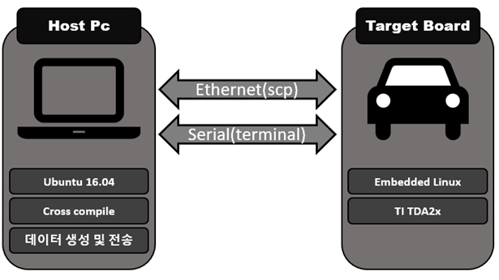
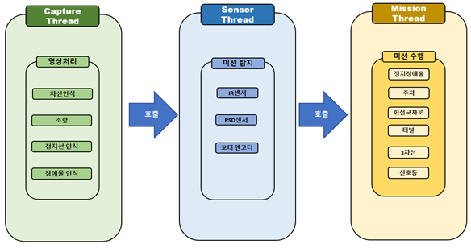
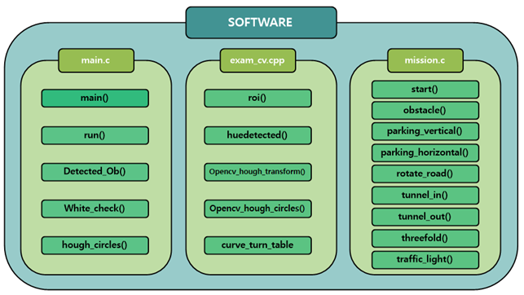

# 2020ESW_AutonomousCarContest

[MAZE](https://maze.co.kr) 영차영차 팀 개발내용

개발 기간 : 2020.07 ~ 2020.12 

대회 홈페이지 : [임베디드 SW 경진대회](https://eswcontest.or.kr/main/main.php)

주관 : [임베디드 소프트웨어 시스템 산업협회](https://kessia.kr/main/main.php)

주최 : 산업통상자원부

후원 : 한국전자기술연구원(KETI),한국전자통신연구원(ETRI), 현대모비스, LG 전자 등

[개발완료 보고서 PDF](./PDF/2020ESWContest_자율주행모형자동차_2051_영차영차_개발완료보고서.pdf)

대회 결과 : 특선상(현대모비스) [PDF](./PDF/2020_임베디드소프트웨어공모전_특선상.pdf)

## 팀원 구성

|팀원|맡은 역할|
|:---------:|:---:|
|김진성 (팀장)| 소프트웨어 구조 설계, 전체 미션 알고리즘 통합 |
|김종욱| 차선 인식 및 주행 알고리즘 구현, 회전 교차로 알고리즘 구현  |
|박상재| 주차 및 주행 알고리즘 구현 |
|[이진호](https://github.com/StylishPanther)|전체 미션 알고리즘 통합 및 개발환경 구축 | 
|[고승일](https://github.com/gseung)|주행 알고리즘 및 개발환경 구축|   

## 동작 영상  

- [전체 미션 수행 동영상](https://www.youtube.com/watch?v=f_BQ3XMBDCw)

 

 < 고가 도로 주행 테스트 >
  

  

 < Lane Keeping 알고리즘 테스트 >
  

  

 < 회전 교차로 주행 테스트 >

  

 < 수평, 수직 주차 테스트 >

 

 

 < 터널 통과 테스트 >
  

 

 < 3차선 도로 장애물 통과 테스트 >
  

 

 < 신호등 통과 테스트 >
 

## 작품 설명  

### 하드웨어 품목  

|Hardware Type|Description|  
|:---:|:---:|
|모형자동차|현대모비스 제공||  

### Development Environment

- 노트북에 Ubuntu 16.04를 설치하여 Linux 환경을 제공하는 Host Pc로 활용하였고, 터미널 편집기를 통하여 소스코드를 작성하였다. 모형자동차(Target Board)는 Embedded Linux 기반의 OS(Operating System)를 사용하며, Serial 통신 및 Ethernet을 통해 Host Pc와 상호작용한다.

- Serial 통신을 통해 Target Board의 터미널을 확인함으로써 센서값 ,영상 픽셀값 등을 출력하여 디버깅에 활용하였으며 Ethernet을 통해 Host Pc에서 작성한 실행파일의 데이터를 Target board에 전송하였다. 

- 기본적으로 C언어를 통해 소스코드를 작성하였으며, 차선인식 및 신호등과 같이 영상처리가 필요한 부분은 C++언어를 활용하였다. 이때 주어진 OpenCV 라이브러리의 함수를 적극적으로 활용하여 작성하였다.

 

 < Software Architecture >

### Program Flow Chart

- 쓰레드간의 메모리충돌을 막기 위해 mutex 잠금을 통해 동기화하였으며, 조건변수를 활용하여 쓰레드 간의 호출에 이용하였다. 이때 각 쓰레드는 잠금 되었다가 호출에 따라 활성화와 비활성화를 반복한다. 전체 쓰레드 구조는 capture_thread, sensor_thread 그리고 각 미션 쓰레드들로 구성된다. 

 

 < Thread Architecture >
  

- capture_thread는 영상처리 및 주 쓰레드로써 일정 주기마다 sensor_thread를 호출한다. 호출에 따라 sensor_thread가 라인 감지용 IR 센서, 벽을 감지하는 적외선 PSD 센서를 통해 미션을 검출한다. 이때 mode_count에 따라 해당하는 mission에 대한 센서값만을 검출하도록 한다. 

- 조건을 만족하면 각 미션에 해당하는 mission thread를 호출한다. 각 mission thread는 미션을 수행하고, 스스로 종료한다.

### Software Architecture
 

 

 < Software Architecture >
 
